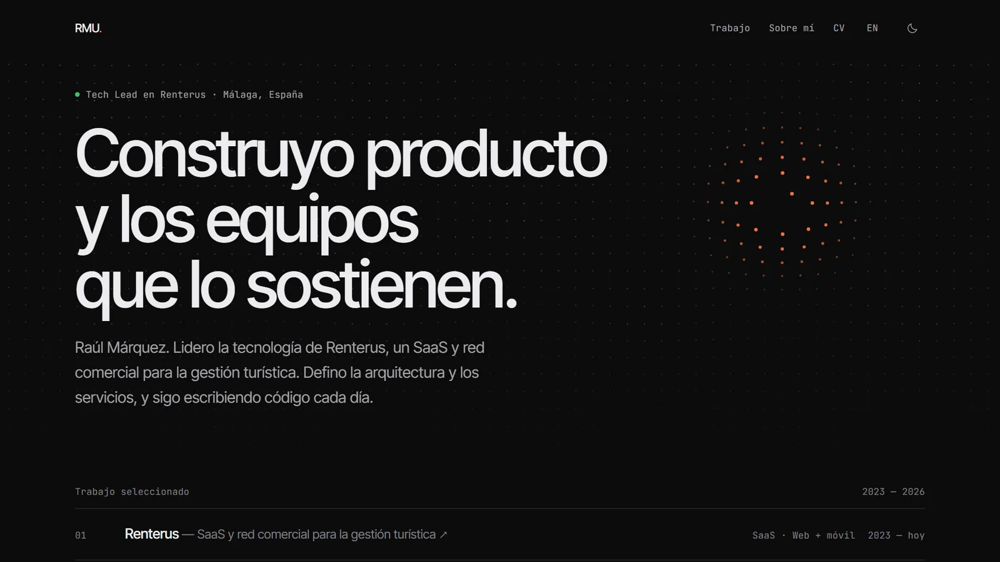

# raulmarquez.dev

Portfolio de Raúl Márquez, Tech Lead & Lead Developer en Renterus → **[raulmarquez.dev](https://raulmarquez.dev)**

[](https://raulmarquez.dev)

Hecho para durar: el contenido vive en ficheros de datos validados, el diseño en tokens y el resultado es HTML estático en la red de Cloudflare. Actualizarlo es editar datos, no código.

## Stack

- **Astro 7**, estático, con TypeScript strict
- **Tailwind CSS 4**, con tokens OKLCH y tema claro/oscuro
- **MDX** y content collections validadas con Zod
- **i18n** nativo: español en `/`, inglés en `/en/`
- **Biome**, **Playwright** + **axe**, GitHub Actions
- **Cloudflare Workers**, solo ficheros estáticos

## Lo que hace el build

- Genera cada página en los dos idiomas, con `hreflang`, datos estructurados y una CSP con hashes de cada script y estilo en línea.
- Dibuja una imagen para redes sociales (Open Graph) por página e idioma, con satori y resvg.
- Imprime el CV a PDF desde la propia página `/cv/`, así que siempre coincide con los datos.
- Genera los iconos y el manifest a partir de un único SVG.

El CI lo comprueba todo en Chrome (escritorio y móvil), Firefox y WebKit: rutas, accesibilidad con axe, temas, idiomas y política de seguridad. Si pasa, despliega. Además recompila una vez al mes, porque las duraciones ("2 años y 11 meses") se calculan al compilar.

## Desarrollo

```bash
pnpm install
pnpm dev        # http://localhost:4321
pnpm check      # tipos + lint
pnpm build      # dist/, con el PDF del CV (necesita: pnpm exec playwright install chromium)
pnpm test       # contra el build
```

## Contenido

Todo lo que se lee en la web está en `src/content/`:

| Fichero | Qué contiene |
|---|---|
| `profile.yaml` | nombre, titular, estado y enlaces |
| `experience.yaml` | trayectoria, un puesto por entrada (las duraciones se calculan solas) |
| `education.yaml` | formación |
| `principles.yaml` | cómo trabajo |
| `stack.yaml` | herramientas (/uses) |
| `pages/{es,en}/about.mdx` | sobre mí |
| `projects/{es,en}/*.mdx` | casos de estudio, con su portada y su diagrama de arquitectura (`draft: true` = no se publica) |

## Uso

El código está aquí para consultarlo e inspirarse. Los textos, las imágenes y los logotipos no se pueden reutilizar; el logotipo de Renterus pertenece a Renterus.
